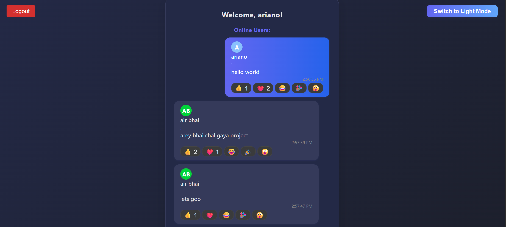
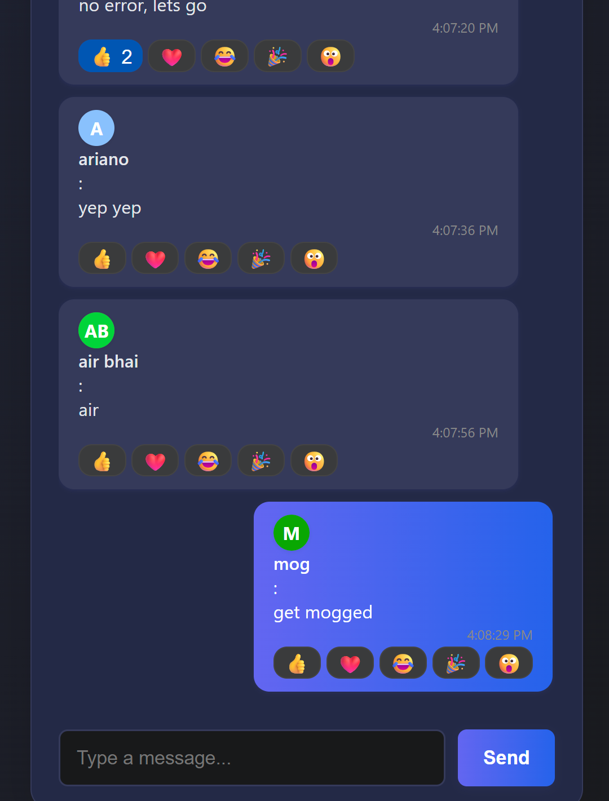

# Real-Time Chat Application


*Modern dark mode chat UI with reactions, avatars, and more!*


*Multiple users, reactions, and beautiful chat bubbles!*

A full-stack real-time chat application built with Node.js, Express, Socket.IO, and React.

## Features
- User registration & login (JWT authentication, password hashed)
- Persistent chat history (file-based storage)
- Real-time public and private messaging
- Typing indicator
- Online users list
- Message reactions (emojis)
- User avatars (initials, colored)
- Theme toggle (dark/light mode)
- Browser notifications for new messages
- Responsive, modern UI (mobile & desktop)

## Tech Stack
- Node.js, Express.js
- Socket.IO
- React
- bcrypt, jsonwebtoken, fs-extra

## Getting Started

### Prerequisites
- Node.js (v14+ recommended)
- npm

### Backend Setup
1. Open a terminal and navigate to the `backend` directory:
   ```bash
   cd backend
   ```
2. Install dependencies:
   ```bash
   npm install
   ```
3. Start the backend server:
   ```bash
   node server.js
   ```
   The backend will run on `http://localhost:5000` by default.

### Frontend Setup
1. Open a new terminal and navigate to the `frontend` directory:
   ```bash
   cd frontend
   ```
2. Install dependencies:
   ```bash
   npm install
   ```
3. Start the React app:
   ```bash
   npm start
   ```
   The frontend will run on `http://localhost:3000` by default.

## Usage
- Open [http://localhost:3000](http://localhost:3000) in your browser.
- Register a new account or log in with an existing one.
- Use the public chat or click an online user to start a private chat.
- React to messages, switch themes, and enjoy browser notifications!

## Project Structure
```
Chatli/
  backend/      # Node.js + Express + Socket.IO server
  frontend/     # React client app
```

## Screenshots
*Add screenshots or a GIF here to showcase your app!*

## License
MIT License
